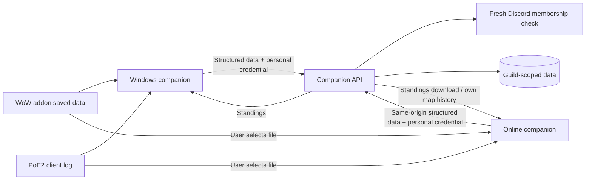

# Guilded companion: desktop and online

The companion now has one branded interface for the Windows installer and a
no-install browser version at `/companion/` on the bot's HTTPS hostname. This
work remains local until the release gates and server update are completed.
Version stays 5.0.0.

## What changed

The old companion concentrated setup, long paths and status text in three
screens, with a generated coin icon unrelated to Guilded's artwork. The new
interface uses the owner's `docs/branding/guilded-logo-400.png`, a navy, gold
and blue palette, clearer typography, individual game pages, useful empty
states, guided connection steps and a responsive navigation layout.

Overview shows actual sync state, never sample statistics. WoW has saved-data
and standings actions. PoE2 has the declared profile, upload queue and the
member's 15 most recent server observations. Activity supports search and
severity filters. Light/dark appearance is saved locally. Support summaries
exclude credentials, account IDs, paths and raw logs. Desktop tracking can be
paused and resumed without deleting settings.

## Choose a delivery mode

| Capability | Windows companion | Online companion |
| --- | --- | --- |
| Companion installation | Per-user Windows installer | None; visit the HTTPS page |
| WoW character/profession/readiness sync | Watches Guilded.lua after /reload | Select Guilded.lua, then Sync now |
| WoW standings | Writes Standings.lua automatically | Download Standings.lua and place in Interface/AddOns/Guilded |
| PoE2 observations | Watches new Client.txt entries | Select Client.txt and preview completed transitions from the latest 24 hours |
| Existing PoE2 history | Skipped when first enabled | Explicit manual import; limited to the file's last 8 MB |
| Background capture | Works in the tray | Select an updated file again after playing |
| Unsent PoE2 visits | Durable device journal | Tab-session queue, retained on refresh |
| Personal map history | Authenticated server view | Same authenticated view |

WoW still needs the Guilded addon to produce saved data. No browser can
silently access arbitrary game files or perform desktop-style background
sync. The first online release deliberately uses ordinary file selection,
which works without relying on the limited-availability File System Access
API. A future permission-based watcher could operate while the page stays
open in supported browsers; it must never be presented as equivalent to the
installed companion.

Browser files are snapshots: reselect Guilded.lua after /reload, and Client.txt
after playing. Choose only logs from the character/league you declare. The
log does not identify or verify either. Visits are observations, including
portal reentry and possible failed loads; they prove no clears, deaths, loot,
XP or party participation and award no automatic points.

## Pairing and privacy

1. Generate a private code in your Discord server using `/character pair` or
   `/poe pair`. It expires after 15 minutes and can be exchanged once.
2. Enter the server ID and code in Connection & setup.
3. Choose your games and files, save preferences, then sync.

Both modes retain the existing personal credential contract: pairing a new
companion replaces the previous link for this member. Online and desktop
links are therefore alternatives, rather than concurrent sessions. A future
multi-device design would need explicit bounded sessions and revocation.

The browser retains settings, its credential and parsed unsent PoE2 visits in
sessionStorage for this tab. It does not keep raw files, chat or whole logs.
Refresh retains queued visits; closing the tab ends the session and file
selection. Browser session restore can retain sessionStorage according to
the browser's behavior. Use Disconnect this session to revoke the presented
credential at the bot and clear local session data. Merely closing a tab
does not revoke the server credential; fresh pairing replaces it.

Browser uploads use same-origin requests with the existing personal header;
no third-party scripts, broad CORS policy or global token bypass is added.
The bot freshly verifies Discord membership and officer status. It restricts
personal WoW uploads to owned characters and always binds PoE2 records to
the authenticated member, including officers. Private API responses are
not cached. Static serving has an explicit asset allowlist, a restrictive
content-security policy and frame blocking.

The Lua parser and standings formatter are shared between both clients.
PoE2 parsing and state transitions are also shared; Node SHA-256 and browser
Web Crypto produce identical references, so repeated imports deduplicate on
the existing database constraint. The browser sends batches of at most 100,
retains unacknowledged visits, coalesces sync actions and blocks changing a
queued profile or server until pending visits are synced.

## Build and preview

`npm run companion:build` copies the owner's logo and creates the browser
bundle. `node scripts/preview-companion.mjs` serves a **public-files-only**
preview at `http://127.0.0.1:8799/companion/`; it has no bot, database or
credentials. Do not start a live bot to preview this interface.

`npm run dist --prefix companion-app` builds the per-user Windows installer.
All shared Node parser modules are included in packaged resources. The app,
tray and installer use the owner's logo; Windows executable resource editing
is enabled while certificate signing is disabled. No signing certificate is
configured, so this is not a signed public release.

## Server release

Follow `V5_0_RELEASE_HANDOFF.md`: CI PostgreSQL/restore and Windows packaging,
ledger preflight, backup and real-client gates remain required. This UI adds
no migration; the earlier PoE2 mapping migration is still required.

The setup/update scripts now run `npm run companion:build` before starting
the released code. The repository Caddy template proxies `/companion` and
`/companion/*` alongside `/api/v1/*`. For an **existing** Oracle installation,
the update script preserves the host-specific Caddy configuration: add the
two companion `handle` blocks from `deploy/Caddyfile` to that configuration,
keeping its actual hostname and other custom rules; validate and reload
Caddy during the approved release. Keep port 8787 bound to loopback.

The intended public URL is `https://guildedqc.duckdns.org/companion/` after
that release. This document does not claim it is currently deployed.

Before public distribution, verify Windows install/uninstall, the app's
taskbar/tray icons, both game files in real clients, browser pairing/revocation,
browser downloads and refresh recovery. Check supported browsers and small
screens. Full French companion localization, bounded concurrent-device
sessions, permission-based browser watching and signed release/download
hosting remain follow-up work; the UI does not expose fake controls for them.

Browser constraints: [MDN file picker support](https://developer.mozilla.org/en-US/docs/Web/API/Window/showOpenFilePicker)
and [Chrome file access permissions](https://developer.chrome.com/docs/capabilities/web-apis/file-system-access).

## Local verification, October 1, 2026

The full offline suite passed 983 tests in 129 files. All 17 browser file,
session/retry and HTTP boundary tests passed again after the retry-status fix.
Type checking, ESLint and addon validation passed. Dark/light layouts and a
390-pixel browser layout were reviewed in Chrome. The Windows program icon
was extracted and verified as the owner's logo, and packaged renderer and
engine resources were inspected. Actual installation, live game syncing,
PostgreSQL/restore CI and public deployment still require the release gates.

The reviewed local installer is
`dist/companion-ready/Guilded Companion Setup 5.0.0.exe`.
Visual previews are in `dist/companion-preview/overview.png` and
`dist/companion-preview/overview-light.png`. Existing installers and the user's
companion configuration were preserved.
