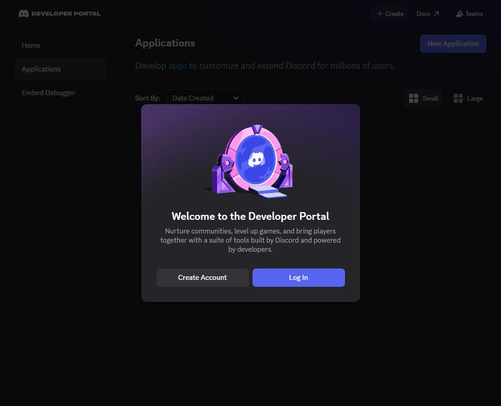
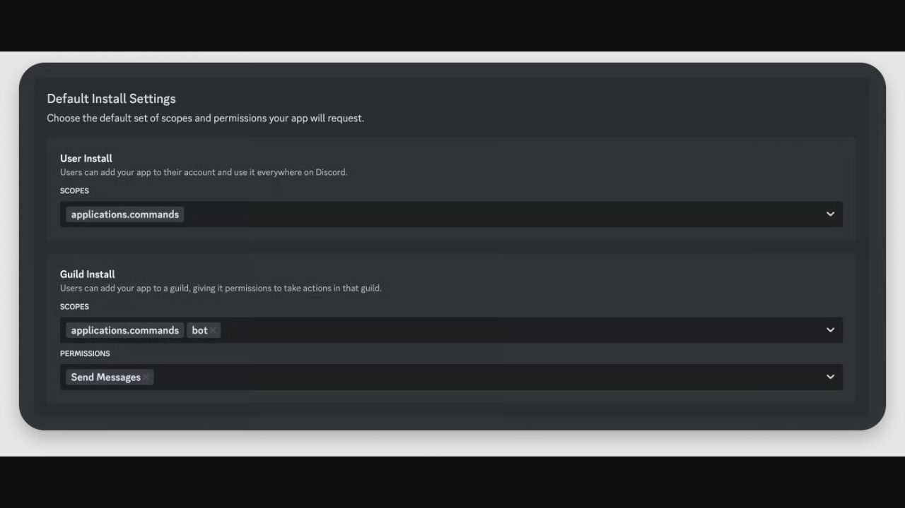
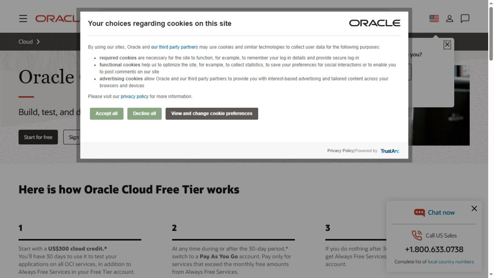
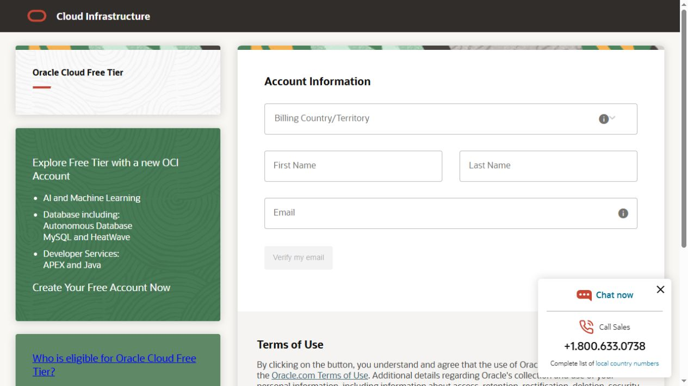
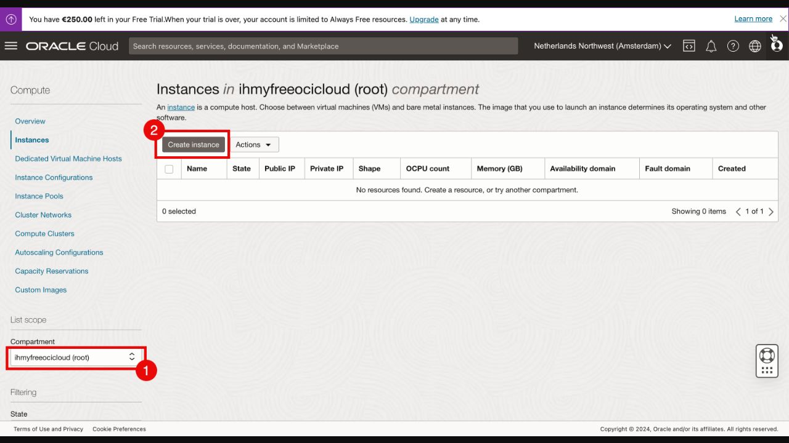
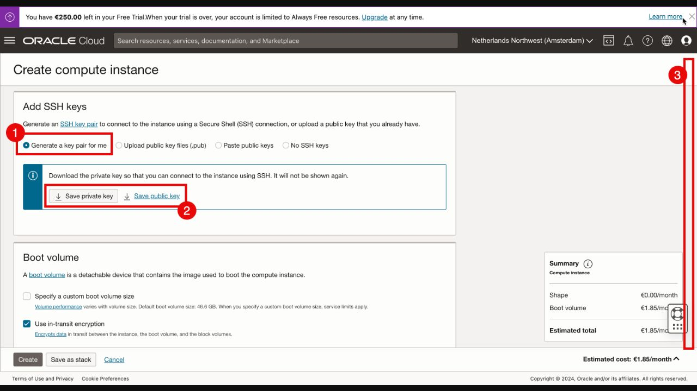
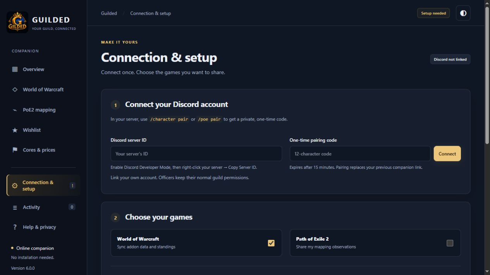

# Set up Guilded for your guild, from scratch

You do not need to write code. You will create a few accounts, choose settings,
and paste commands into a server window. Keep this guide open on your Windows PC.
For an existing installation, use the release update guide instead.

**Plan your time:** allow an unhurried first session for account verification and
hosting. The 30-minute target starts once your server, database and hostname are
ready. Oracle approval, capacity and DNS delays are outside Guilded's control.
Guilded 6.0.0 is the full Release; a timed beginner walkthrough is still pending.

**Jump to a step:** [Discord bot](#1-create-the-discord-bot) ·
[Invite](#2-invite-it-to-your-discord-server) ·
[Oracle account](#3-make-your-oracle-cloud-account) ·
[Ubuntu server](#4-create-the-ubuntu-server) ·
[Database](#5-create-the-postgresql-database) ·
[Web address](#6-give-the-server-a-web-address) ·
[SSH](#7-open-a-command-window-on-the-server) ·
[Install](#8-install-the-selected-guilded-release) ·
[Discord wizard](#9-let-the-discord-wizard-create-the-guild-layout) ·
[First player](#10-connect-your-first-player) ·
[Member message](#11-give-everyone-one-message).

## Your checklist

- [ ] Create your Discord bot and invite it.
- [ ] Create an Oracle account and Ubuntu server.
- [ ] Create a PostgreSQL database and a public hostname.
- [ ] Connect to the server and install Guilded.
- [ ] Fill four settings and pass the setup check.
- [ ] Run the Discord wizard and connect one officer and one member.

**What these words mean:** a *server/VM* is the computer that keeps your bot online;
*PostgreSQL* stores your guild's records; *DNS/hostname* is the web address members
visit; *SSH* opens a secure command window on your server; an *SSH private key*
unlocks that server. The Windows companion remains on each player's own PC.

## Keep a private setup note

Use a password manager or a private local note. Do not paste secrets into Discord,
AI chats, screenshots, GitHub issues or the landing page.

| Item | Where you get it | May you give it to members? |
| --- | --- | --- |
| Application ID | Discord → General Information | Yes, usually unnecessary |
| Bot token | Discord → Bot | **No** |
| Discord server ID | Right-click your server | Yes |
| Server public IP | Oracle instance page | It is public; members use the hostname |
| SSH private key | Download during instance creation | **No** |
| Database connection string | Neon → Connect | **No** |
| Bot hostname | Your DNS provider | Yes |
| Addon + companion links | Matching release | Yes |

## 1. Create the Discord bot

Open the [Discord Developer Portal](https://discord.com/developers/applications).
Sign in with the account that manages your guild's Discord server.



*Captured 5 October 2026: the signed-out entry screen. Choose Log In if you already use Discord.*

1. Choose **New Application**, name it for your guild (for example, `Guilded — My Guild`),
   review Discord's terms and create it.
2. Open **General Information**. Copy **Application ID** into your private setup note.
3. Open **Bot**. Generate/copy the bot token using **Reset Token** if required.
   Complete Discord's verification yourself. Save the token privately; resetting
   it later invalidates the old token. Do not reset an existing live bot's token for this test.
4. In **Privileged Gateway Intents**, enable **Server Members Intent**, then save.
   Leave **Message Content Intent** off for initial setup. Guilded's optional
   answer-channel feature can be configured later.
5. Leave **Interactions Endpoint URL** empty. Guilded handles Discord through its
   own connection; do not follow the sample tutorial's ngrok or code-writing steps.

**Success check:** you have an Application ID and private bot token, and Server
Members Intent is enabled. Reference: [Discord application setup](https://docs.discord.com/developers/quick-start/getting-started)
and [privileged intents](https://support-dev.discord.com/hc/en-us/articles/6207308062871-What-are-Privileged-Intents).

## 2. Invite it to your Discord server

In the application's **Installation** page, use **Guild Install**. Under
**Default Install Settings**, choose `bot` and `applications.commands`.



*Screenshot of Discord's official example, captured 5 October. It shows the location
of the controls, not Guilded's full permissions. Use the list below, not only Send Messages.*

Choose these bot permissions:

- View Channels, Send Messages, Embed Links, Attach Files, Read Message History.
- Send Messages in Threads, Create Public Threads, Manage Threads.
- Manage Channels, Manage Roles and Manage Messages.
- Create Events and Connect (for events using voice channels).

Additional moderation permissions are needed only for moderation features you
choose to use. The initial setup does not require Administrator permission.
Copy the **Discord Provided Link**, open it, choose **Add to server**, select your
guild, review the permissions and authorize it.

In Discord, open **Server Settings → Roles**. Move the bot's role above roles it
will assign, including applicant, member and game roles. You can revisit this
after the setup wizard creates roles. In your Discord user settings, enable
**Advanced → Developer Mode**. Right-click the server icon and **Copy Server ID**.

**Success check:** the correct bot appears in your server. Offline is expected
until step 8. Your server ID is a long number, not the server's name or invitation link.

## 3. Make your Oracle Cloud account

Start at [Oracle Cloud Free Tier](https://www.oracle.com/cloud/free/) and choose
**Start for free**, or open the [signup form](https://signup.cloud.oracle.com/).





*These are real public pages captured 5 October 2026. No account details were entered.*

Enter your real billing country, name and email. Follow the email verification,
account security, home-region and payment-verification prompts. Complete these
personally. Oracle may require a card for identity checks and temporary holds;
read the current terms before submitting. Choose a nearby home region carefully.

**Always Free and trial credit are different.** A resource using trial credit is
not necessarily free after the trial ends. Use options marked **Always Free
Eligible**, check the estimate before creating resources, and do not upgrade to
Pay As You Go merely to follow this guide. Availability is not guaranteed.
See [Oracle's current terms and FAQ](https://www.oracle.com/cloud/free/faq/).

**Success check:** you can open the [Oracle Cloud console](https://cloud.oracle.com/).
If signup or capacity is refused, stop here; do not create repeated free accounts.

## 4. Create the Ubuntu server

Oracle may change console layouts. The [official first-instance guide](https://docs.oracle.com/en-us/iaas/Content/Compute/tutorials/first-linux-instance/overview.htm)
provides the current navigation. **For Guilded choose Ubuntu, even if an Oracle
example screenshot shows Oracle Linux.** Our installer uses Ubuntu packages.

1. If you have no network, use **Networking → Virtual cloud networks → Start VCN
   Wizard → Create VCN with Internet Connectivity**. Name it `guilded-network`
   and retain the wizard's public subnet/internet gateway. A compartment is
   simply a folder for cloud resources; use a dedicated `Guilded` compartment or your existing one.
2. Open **Compute → Instances → Create Instance** and name it `guilded-bot`.
3. Under image settings, choose **Canonical Ubuntu 24.04** (22.04 is also supported).
   Pick a compatible Always Free eligible shape offered in your account. A small
   AMD VM works with the installer's swap; an eligible A1 VM is another option.
   Review the actual memory, storage and price estimate rather than copying old quotas.
4. Select your network's **public subnet** and enable a **public IPv4 address**.
5. Under **Add SSH keys**, choose to generate a key pair. Save both files, especially
   the private `.key` file, before continuing. Keep them in a private folder you can find.
6. Review the estimate and create the instance. Wait for **Running**, then note its
   public IPv4 address. For the Ubuntu image the SSH user is `ubuntu`.





*Screenshots of Oracle's published tutorial examples, captured 5 October 2026.
The original tutorial is from 2024. Account names, regions, IPs and images shown
are examples, not your values. Source: [Oracle's illustrated tutorial](https://docs.oracle.com/en/learn/first-oci-linux-instance/).
Use [current instance instructions](https://docs.oracle.com/en-us/iaas/Content/Compute/Tasks/launchinginstance.htm) if controls have moved.*

### Allow web traffic

Open your instance's subnet and its attached **Security List → Ingress Rules**.
Add stateful TCP rules for destination port **80** and **443**, source CIDR
`0.0.0.0/0`, source port **All**. These make the website reachable. Keep SSH port
22 limited to your own public IP where practical; do not remove your working SSH
rule before confirming replacement access. Do not open 8787 or the database port
on this VM. If you selected a Network Security Group too, check its rules as well.
[Oracle security-list reference](https://docs.oracle.com/en-us/iaas/Content/Network/Concepts/securitylists.htm).

**Success check:** the instance is Running, you saved the key, and you know its
public IPv4 address. “Out of capacity” means Oracle cannot supply that choice;
retry an eligible available option later, rather than unknowingly choosing a paid shape.

## 5. Create the PostgreSQL database

Guilded needs **PostgreSQL**, not Oracle Autonomous Database or MySQL.
One option is [Neon](https://neon.com/): open its console, sign up and create a
project for this guild. Choose PostgreSQL 16 or newer and a region near your bot.
Review the current plan and limits. Use **Connect** to copy a PostgreSQL connection
string for your project/database. Prefer the direct connection for this simple
single-bot installation and preserve the provider's SSL parameters.

Save that entire string privately as `DATABASE_URL`. It contains a password.
Do not share a screenshot of the Connect dialog. You do not need to create
individual tables; Guilded creates them when its service starts.
[Neon connection instructions](https://neon.com/docs/connect/connect-from-any-app).

**Success check:** your database project exists and you have its private connection
string beginning `postgresql://` or `postgres://`. An existing database needs the
backup/update procedure instead of this fresh-install path.

## 6. Give the server a web address

You can use a domain you own. For a free subdomain, visit [Duck DNS](https://www.duckdns.org/),
sign in using an offered provider, choose an available name, and set its IPv4
address to the Oracle instance's public IPv4 address. Save/update it. Example:
`myguild.duckdns.org`. **Use your own chosen name everywhere below.**

In Windows PowerShell, replace the example and check DNS:

```powershell
nslookup myguild.duckdns.org
```

**Success check:** the answer includes your Oracle public IP. DNS can take time.
Do not continue with another guild's hostname or a private `10.x.x.x` address.
HTTPS needs correct DNS and reachable ports 80/443; [Caddy explains why](https://caddyserver.com/docs/automatic-https).

## 7. Open a command window on the server

On Windows, open **Start → PowerShell**. Paste this after replacing the key path
and `YOUR_SERVER_IP`. Keep quotes around the key path if it contains spaces.

```powershell
ssh -i "C:\Users\YOUR_WINDOWS_NAME\Downloads\your-oracle-private.key" ubuntu@YOUR_SERVER_IP
```

A first-connection fingerprint prompt is normal; verify the server identity against
your Oracle connection information before accepting it. If the key is rejected as
“too open,” follow the **Set the Permissions for the Private Key File** steps in
[Oracle's Windows SSH instructions](https://docs.oracle.com/en-us/iaas/Content/Compute/tutorials/first-linux-instance/overview.htm#connect-to-your-instance).
Never send the key to support. A timeout usually means wrong public IP, SSH rule,
subnet/routing or a server that has not finished booting.

**Success check:** the prompt changes to something like `ubuntu@guilded-bot:~$`.
Commands in the next step go into **that server window**, not a second Windows terminal.

## 8. Install the selected Guilded release

Use matching addon, companion and bot source from [GitHub Releases](https://github.com/kevincaron28/Guilded/releases).
A beta supplied directly by the maintainer needs its matching source commit.
Do not guess a release tag: read it from the release notes. Do not paste commands
containing `PASTE_RELEASE_TAG_OR_COMMIT` unchanged.

Run these on the Ubuntu server, one block at a time. Stop if a command fails.

```bash
sudo apt-get update
sudo apt-get install -y git
```

```bash
git clone https://github.com/kevincaron28/Guilded.git guilded
cd guilded
git checkout PASTE_RELEASE_TAG_OR_COMMIT
```

Replace the hostname with your name from step 6:

```bash
sudo bash deploy/setup-server.sh myguild.duckdns.org
```

Wait for **Done. Next:**. The installer copies the app to `/opt/guilded`, installs
its dependencies and the HTTPS proxy, and prepares the service. It does not start
the bot. Use a dedicated host: the installer replaces that host's Caddy configuration.

Open the settings file:

```bash
sudo nano /opt/guilded/.env.local
```

Use arrow keys to move. Fill the four lines below with your own values, without
angle brackets. Leave optional settings alone. Keep the API on `127.0.0.1:8787`
and `MESSAGE_CONTENT_INTENT=false`. Never paste your values into this guide.

```text
DISCORD_TOKEN=your-private-bot-token
DISCORD_CLIENT_ID=your-application-id
DISCORD_GUILD_ID=your-discord-server-id
DATABASE_URL=your-private-postgresql-connection-string
```

In nano, **Ctrl+O**, **Enter** saves; **Ctrl+X** exits. Then:

```bash
cd /opt/guilded
sudo -u guilded npm run setup:check
```

**Success check:** every check says PASS. This verifies the settings' shape; it
cannot prove a token or database password is valid. Fix any FAIL before starting.

Start the single bot service:

```bash
sudo systemctl start guilded
sudo systemctl status guilded --no-pager
sudo journalctl -u guilded -n 50 --no-pager
```

The first start applies database migrations. Do not run another local bot with
this token. `active (running)` plus the following checks confirms basic startup:

- Open `https://myguild.duckdns.org/health`: expect `ok: true` and the intended version.
- Open `https://myguild.duckdns.org/companion/`: expect **Connection & setup**.
- In your Discord server, `/report ping` responds.

Replace the hostname in both URLs. A browser certificate warning is a failed
HTTPS checkpoint; fix DNS/firewalls/certificates rather than asking members to bypass it.

## 9. Let the Discord wizard create the guild layout

Run `/setup start` as a server administrator. Choose English or Français, select
existing roles/channels or **Create missing roles/channels**, and proceed through
the screens. Use **Update bot messages**, then `/setup start status:true` to check
what remains. Recheck bot-role order if role assignment fails.

Use `/core setup` for your first raid roster. Choose its loot system and points
pool. A priority-loot core needs item prices before an award test. Optional AI,
Warcraft Logs and community features can wait until the basic setup works.

**Success check:** one ordinary member sees the intended member channels and
cannot see officer-only channels or use officer actions. Administrator testing
alone does not prove member permissions are correct.

## 10. Connect your first player

Follow [Member installation](MEMBER_INSTALL.md). Install the addon into the actual
WoW client, open the game and `/reload`. For automatic syncing install the Windows
companion. For manual syncing use your own `https://myguild.duckdns.org/companion/`.



*Guilded 6.0.0 local UI preview. This screenshot proves the page layout, not a live account connection.*

Each player runs `/character pair` in **your** Discord server and enters their own
private code. Browser pairing replaces that player's previous companion link;
choose one mode while testing. In the browser, select the account's saved
`Guilded.lua`, save preferences and **Sync now**. Download standings into the
addon's folder and `/reload` again. The Windows companion handles those files automatically.

**Success check:** upload succeeds, the correct character is linked, and returned
standings match Discord. Repeat with an ordinary member before inviting everyone.
A public web page loading is not proof that authenticated uploads work.

## 11. Give everyone one message

Fill the placeholders, then pin this in your guild's Discord:

```text
Guilded for our guild
Addon: <matching addon download>
Windows companion: <matching installer download>
Guide: <member guide link>
Discord server ID: <our server ID>
Bot address: https://<our-hostname>/api/v1/addon-imports
Online companion: https://<our-hostname>/companion/
Install the addon, log in and /reload. Use /character pair here for your own code.
Never share the code. For help, contact <our officer>.
```

## If you get stuck

| Symptom | Check this first |
| --- | --- |
| Oracle signup/capacity fails | Provider approval or available eligible shapes; it is not a Guilded error |
| SSH times out | Running instance, public IPv4, public subnet, internet route and port 22 rule |
| Permission denied (publickey) | Correct private key and Ubuntu username; key file permissions |
| Hostname points elsewhere | Correct the DNS IPv4 and allow propagation |
| Website unavailable | Cloud and OS firewall ports 80/443, service state and Caddy logs |
| Database authentication error | Full provider connection string and SSL options; do not reset the database |
| Used disallowed intents | Enable Server Members Intent for the exact bot application |
| Commands missing | Correct application/server IDs, bot invite scopes and service registration logs |
| Cannot create channels/roles | Bot permissions, channel overrides and role order |
| Online Test connection works but upload fails | Pairing, server ID, selected file and current guild membership |
| Two replies to every command | Stop the duplicate process using the same token |

Share the exact error with sensitive values removed. A bot owner can inspect logs
locally; members can use **Activity → Download support summary**. Keep the four
secret settings, keys and credentials private.

## What is verified, and what is still pending?

Guide checked against public vendor pages on **5 October 2026**. Public entry
screens are our captures; private-console illustrations are explicitly credited
vendor examples. No Oracle account was created or charged for making this guide.
Fresh Oracle provisioning, independent Discord-guild acceptance and a timed
novice walkthrough still require real tests. The screenshot/source inventory is
[here](images/owner-setup/README.md).
